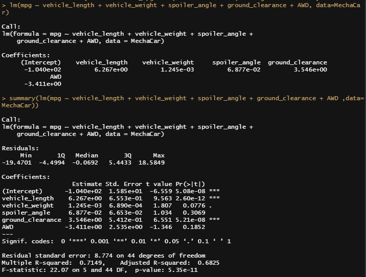

# MechaCar_Statistical_Analysis

## Linear Regression to Predict MPG
The provided dataset has 50 prototypes with 6 variables, mainly the miles per gallon measured across five ohter variables.
An Rscript was used to conduct a linear regression model.
### Results

The above picture shows a summary for the linear regression, the resulting model shows that:
**MODEL:**
mpg = -0.104e+02 + **Vehicle_length***6.267 + **Vehicle_weight***1.245e-03 + **Spoiler_angle***6.877e-02 + **Ground_clearance***3.546 + **AWD***-3.411

**SUMMARY:**
A summary of the linear regression can be displayed to determine the quality of the dataset. In this distribution of the residuals, the dataset fits in with the normal parameters, where the absolute value of the min and max are comparable |-19.47|~|18.58| and the median -.07 is close to zero.

1. Which variables/coefficients provided a non-random amount of variance to the mpg values in the dataset?       
A 95% level of confidence was predetermined, meaning the p-value should be compared to alpha = .05 level of significance to verify if statistically significant. 

Coefficients:      
mpg: 0 < .05, statistically significant, non-random amount of variance     
vehicle length: 0 < .05, statistically significant, non-random amount of variance     
vehicle weight: .08 > .05 not statistically significant, random amount of variance     
spoiler angle: .31 > .05 not statistically significant, random amount of variance    
ground clearance: 0 > .05 statistically significant, non-random amount of variance    
AWD: .19>=.05 not statistically significant, random amount of variance

2. Is the slope of the linear model considered to be zero? Why or why not?    
Converting from scientific notation, all of the slopes of the variables are shown to be non-zero even though some are close to zero:    

Coefficients:    
vehicle length: 6.267    
vehicle weight: .001   
spoiler angle: .069   
ground clearance: 3.546   
AWD: -3.411    

The multiple linear regression formula for mpg = -.01 + 6.267(vehicle length)+.001(vehicle weight)+.069(spoiler angle)+3.546(ground clearance)-3.411(AWD), which results in a non-zero slope.

3. Does this linear model predict mpg of MechaCar prototypes effectively? Why or why not?    
R-squared is .7149, which is a strong correlation for the dataset and shows the dataset is an effective dataset.  However, r-squared is not the only consideration for effectiveness.  There may be other variables not included in the dataset contributing to the variation in the mpg. 

